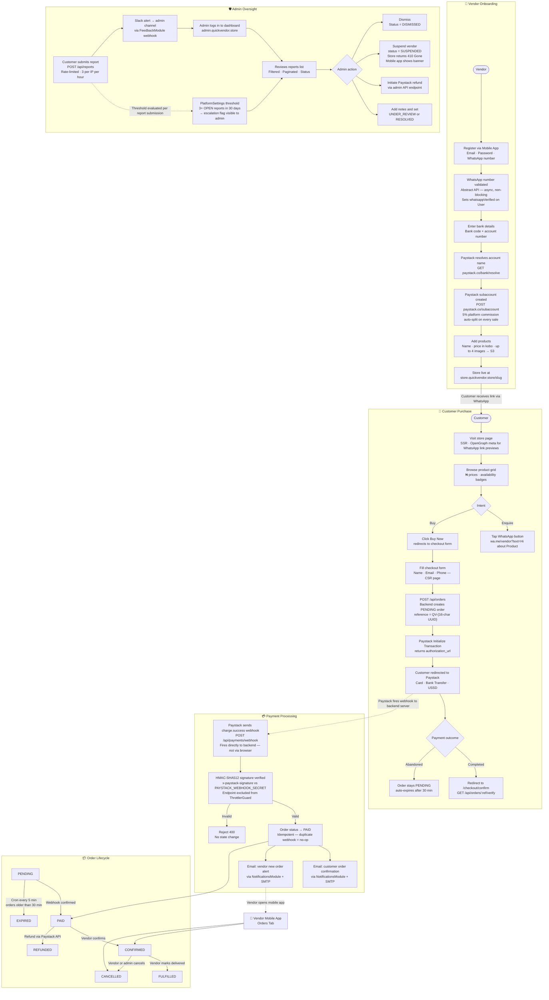

# QuickVendor — System Diagrams

> Paste any diagram block into [mermaid.live](https://mermaid.live) to render and export.
> All diagrams use [Mermaid](https://mermaid.js.org/) syntax and render natively in GitHub Markdown.

---

## 1. End-to-End Platform Flow

Complete lifecycle from vendor onboarding through customer purchase, payment processing, order fulfilment, and admin oversight.



---

## 2. Backend Service Architecture

All NestJS modules, internal wiring, and connections to external services and data stores.

```mermaid
graph TB
    subgraph CLIENTS["Client Layer"]
        MOB["📱 Mobile App\nExpo 54 · React Native\nVendor-facing · store.quickvendor.store"]
        SF["🌐 Storefront\nNext.js 16 App Router SSR\nstore.quickvendor.store"]
        ADM["🖥️ Admin Dashboard\nNext.js 16 + shadcn/ui\nadmin.quickvendor.store"]
    end

    subgraph NESTJS["⚙️  NestJS API  —  api.quickvendor.store  —  Port 3000"]

        PIPE["Global Request Pipeline\nValidationPipe · CookieParser · URLEncoded · CORS\nThrottlerGuard — 20 req/min · ServeStatic /uploads"]

        subgraph AUTHLAYER["Auth & Security"]
            GUARDS["Guards\nJwtAuthGuard · RolesGuard · ActiveUserGuard"]
            JWTST["JwtStrategy\nJWT → user lookup\n5-min in-memory user cache\nSuspended users bypass cache"]
            TBL["TokenBlocklistService\nLogout invalidation\nRedis-backed · in-memory fallback\nTTL = JWT expiry"]
        end

        subgraph FEATMODS["Feature Modules"]
            USERS["UsersModule\nProfile · WhatsApp · Bank setup"]
            PRODUCTS["ProductsModule\nCRUD · image upload · availability"]
            STORE["StoreModule\nPublic reads · store by slug"]
            ORDERS["OrdersModule\nCreate · verify · vendor actions\nCron: expire every 5 min"]
            PAY["PaymentsModule\nBanks list · verify account\nSubaccount · Webhook · Refund"]
            ADMIN["AdminModule\nVendors · Orders · Reports · Analytics\nAuditLog · PlatformSettings"]
            REPORTS["ReportsModule\nCustomer dispute submission"]
        end

        subgraph SUPPORTMODS["Support Modules"]
            NOTIF["NotificationsModule\nNodemailer · SMTP\nOrder confirmation · Vendor alert"]
            STORAGE["StorageModule\nDual-provider\nLocal dev  ↔  S3 prod\nproduct-images/{id}/ · store-banners/{id}/"]
            WA["WhatsAppModule\nAbstract API phone lookup\nSets whatsappVerified on User"]
            FEED["FeedbackModule\nSlack webhook notifications\nFeedback · Report alerts"]
            HEALTH["HealthModule\nGET /health\nDB connectivity check"]
        end

        PRISMA["PrismaModule\nPrisma v5 ORM\nConnection pool · type-safe queries"]
    end

    subgraph DATASTORES["Data Stores  (Railway managed)"]
        PG[("PostgreSQL 16\nPrimary database\nUsers · Products · Orders\nReports · AuditLogs · PlatformSettings")]
        REDIS[("Redis 7\nJWT token blocklist\nTTL-keyed logout tokens")]
        S3BUCKET[("AWS S3\nProduct images\nStore banner images\nEphemeral-safe — survives Railway redeploy")]
    end

    subgraph EXTERNAL["External Services"]
        PAYSTACK["Paystack\nNigerian payment gateway\nSubaccounts · Initialize tx\nWebhook · Refunds\nBank resolve API"]
        ABSTRACTAPI["Abstract API\nWhatsApp phone number\nreachability check"]
        SLACKWH["Slack\nAdmin alert webhooks\nFeedback · Report submissions"]
        SMTPSVR["SMTP Server\nTransactional email\nOrder confirmation · Suspension notice"]
        SENTRYIO["Sentry\nError tracking + performance\nGlobal exception filter"]
    end

    %% Clients → Pipeline
    MOB & SF & ADM -->|"HTTPS · REST · JWT Bearer / Cookie"| PIPE

    %% Pipeline → Auth
    PIPE --> GUARDS
    GUARDS --> JWTST
    JWTST --> TBL
    TBL --> REDIS

    %% Pipeline → Feature modules
    PIPE --> USERS & PRODUCTS & STORE & ORDERS & PAY & ADMIN & REPORTS

    %% All feature modules → Prisma → PostgreSQL
    USERS & PRODUCTS & STORE & ORDERS & PAY & ADMIN & REPORTS --> PRISMA
    PRISMA --> PG

    %% Payments ↔ Paystack  (bidirectional)
    ORDERS --> PAY
    PAY -->|"Bank list · Verify account\nCreate subaccount · Init transaction\nRefund"| PAYSTACK
    PAYSTACK -->|"charge.success webhook\nexcluded from ThrottlerGuard\nHMAC-SHA512 verified"| PAY

    %% File storage
    USERS & PRODUCTS --> STORAGE
    STORAGE -->|"STORAGE_DRIVER=s3 in prod\nfalls back to local if unconfigured"| S3BUCKET

    %% Notifications
    ORDERS --> NOTIF
    ADMIN --> NOTIF
    NOTIF --> SMTPSVR

    %% WhatsApp validation
    USERS --> WA
    WA -->|"Async — never blocks registration\nsets whatsappVerified"| ABSTRACTAPI

    %% Slack alerts
    REPORTS --> FEED
    FEED --> SLACKWH

    %% Error tracking (global)
    PIPE -.->|"Unhandled exceptions\nvia @sentry/nestjs"| SENTRYIO
```



---

## 3. User Journey

Scores reflect ease and satisfaction at each step — 1 (painful) to 5 (effortless).

```mermaid
journey
    title QuickVendor — User Journeys

    section Vendor: Account Setup
        Download and open mobile app: 5: Vendor
        Register with email and WhatsApp number: 3: Vendor
        Enter bank code and account number: 3: Vendor
        See account name auto-resolved by Paystack: 5: Vendor
        Paystack subaccount created automatically: 5: Vendor

    section Vendor: Store Setup
        Upload store banner image: 4: Vendor
        Add product with name, price in naira, and photos: 4: Vendor
        Toggle product availability on or off: 5: Vendor
        Copy store URL and share on WhatsApp: 5: Vendor

    section Vendor: Daily Order Management
        Receive email alert for new order: 5: Vendor
        Open mobile app and see Orders tab: 5: Vendor
        Review customer name, product, and amount: 5: Vendor
        Confirm order is accepted: 5: Vendor
        Arrange delivery and mark order as fulfilled: 4: Vendor

    section Customer: Discovery
        Receive store link via WhatsApp from friend: 5: Customer
        Open link in mobile browser: 5: Customer
        Browse product grid with naira prices: 5: Customer
        Tap WhatsApp button to ask a question: 5: Customer

    section Customer: Purchase
        Tap Buy Now on chosen product: 5: Customer
        Fill in name, email, and phone number: 3: Customer
        Complete payment on Paystack hosted page: 3: Customer
        View order confirmation page in browser: 4: Customer
        Receive confirmation email: 4: Customer

    section Customer: Post-Purchase
        Contact vendor on WhatsApp for delivery update: 5: Customer
        Submit a report if something goes wrong: 2: Customer

    section Admin: Daily Operations
        Log in to admin dashboard: 4: Admin
        Review platform stats on dashboard: 5: Admin
        Search and filter vendor list by status: 5: Admin
        View vendor detail with orders and reports: 4: Admin
        Investigate a flagged report with order context: 3: Admin
        Suspend a bad actor vendor with a reason: 4: Admin
        Mark report resolved and add admin notes: 4: Admin
        Adjust platform commission in settings: 5: Admin
```
